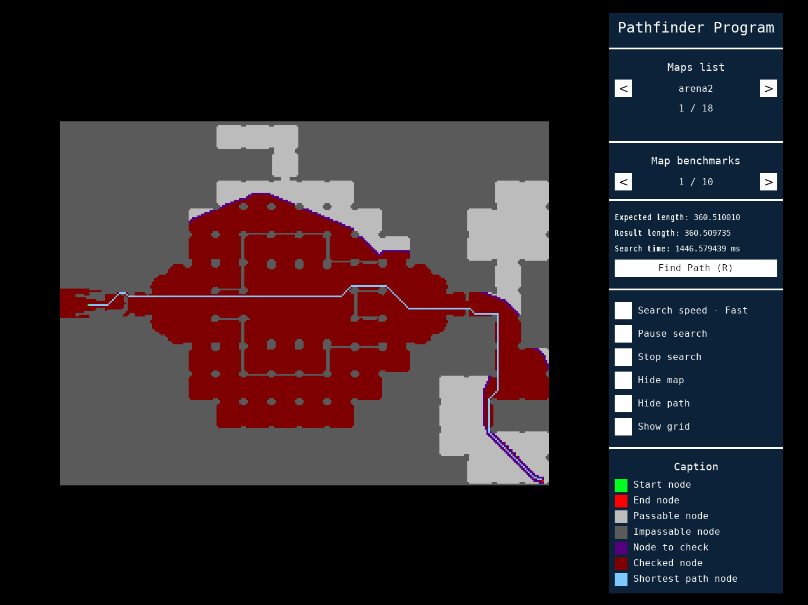
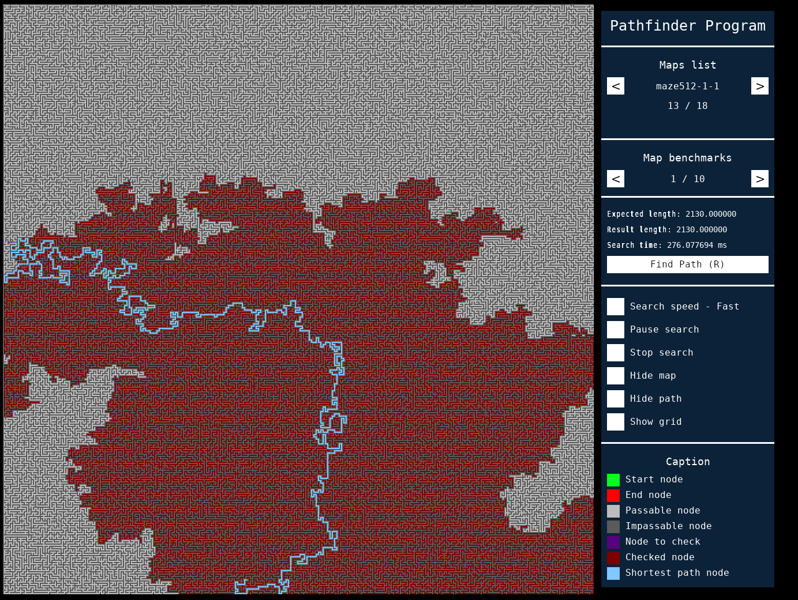
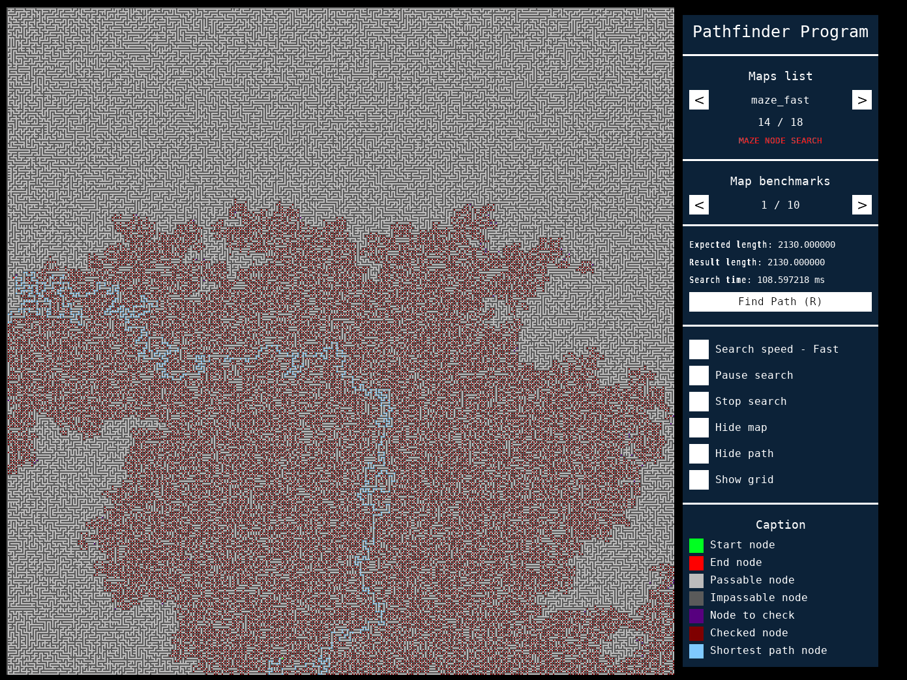
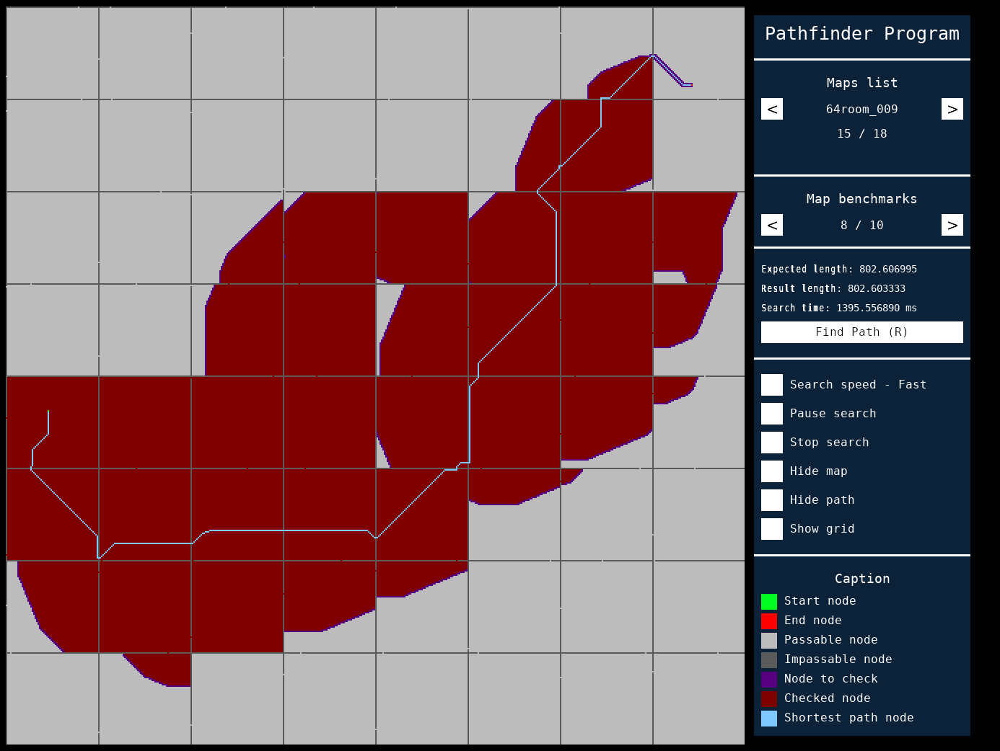
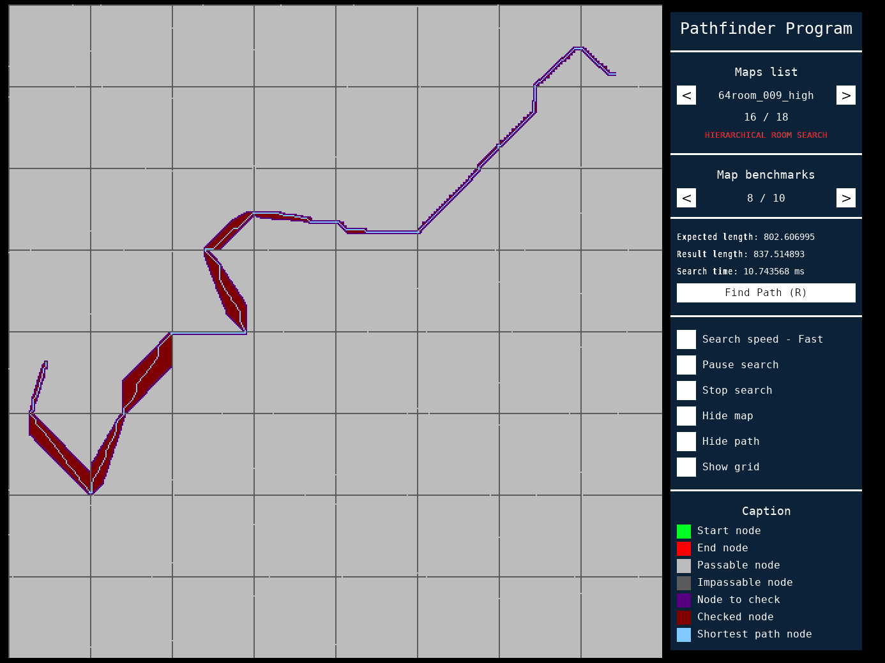

# Pathfind UI project

This project uses one of my implementation of the A* pathfind algoritm (no corner cut), to find the shortest path if several maps available at [http://movingai.com/benchmarks/](http://movingai.com/benchmarks/).
The algorithm found every path tested, although, in some paths I detected a minor floating point error, eg: expected 235.0536 and I got 235.0537. After testing, I found that this is a problem related to the precision of the diagonal movement cost of sqrt(2).

As running the benchmarks on a terminal and reading results was somewhat boring, so I decided to make a UI that shows the algorithm working.
I started by making a rudimentary UI with SDL2, it worked, but was not that good. Then I made my [sdl_gui](https://github.com/N4G170/sdl_gui) and scarped the old ui and made a new one,
it is still bad, but the underlying structure is much better.

To be able to see the progress of the search, the render and search functions cannot be in the same thread, so the search runs in its own, by making an async function call and processing its future. The rendering of the map is, protected with a mutex, because the search algorithm writes on some variables that are used by the map renderer.

Note: As I have, yet, to configure the sdl_gui lib for dynamic linking on windows, static linking is being used instead on both platforms (although dynamic linking already works on linux).


Example of the result of a search.

### Other algorithms
In addition to the base A* algorithm there are available two variations, both of which require the map to be preprocessed.

#### Node based maze search
This is a faster search for the maze maps with paths only one pixel wide (the algorithm needs to be adapted for wider paths).

When the search is requested:
- First the map is analysed so we can find all the positions that can be valid nodes, namely, position where the direction can change (corners and intersections) or dead ends (inside the map or in the border of the map).
- Then a graph is built connecting all nodes to their direct neighbours.
- The graph is then used to search for the path.

Currently the map "maze_fast" is the only map that uses this variant with "maze512-1-1" being original map that uses the regular A*. Both maps are next to each other in the map list to facilitate the search time comparison.


Example of the result of a regular maze search.


Example of the result of the fast maze search for the same map as above (a lot faster).

#### Hierarchical search
The objective of this search is not to find the shortest path, but find a path, quickly.

When a search is requested:
- First we create a new map using each room (both maps are x*x room based) as a node and marking its exit/entry points and neighbours;
- Then we find the shortest number of rooms we need to move through to reach the target
- We then, find the shortest path through the room we found
Like I said, the result may not be the best (eg: expected 856.05, got 877.3), but its fast. You can compare it in the program, as both the hierarchical and non-hierarchical maps have the same benchmarks defined.


Example of the result of a regular room search.


Example of the result of the hierarchical search for the same map as above (a lot faster).

## Running the program
You can download the latest release from the release tab ([link](https://github.com/N4G170/pathfind_ui/releases)) or you can build it yourself.
The windows release has the needed dlls. On Linux make sure to install the dependencies SDL2, SDL2_image, SDL2_ttf.

## Building the program

### On Linux

First install all the dependencies:
- SDL2
- SDL2_image
- SDL2_ttf
- cmake
After that, open terminal window at the root of the project (the folder with this file) and run the commands:
```
- mkdir build
- cd build
- cmake ..  
- make -j
```
Alternatively you can use cmake-gui.

If no errors appear, the build is complete inside the "bin" folder and you can run the program with the command ./pathfind_ui in your terminal (you can only run it from the terminal).

NOTE: As cmake creates the executable as a shared object (I have yet to find why), you have to run the program through the terminal, rather than double click.

### On windows

Note: On windows I only tested using Visual Studio 2017 (you can use whatever you want as long as it supports cpp14).

On windows you need to download [cmake](https://cmake.org/) and use it to create a "vs 15 2017 64bit" solution (needs to be 64bit).
To use cmake, create a "build" folder and set it as build folder. Set the root of the project as the source folder and run it. Inside the build folder will be a vs solution.
Open the solution, set it to release (64bit) and build it. The final build and all needed dlls and the data folder will be inside the "bin/release" folder.

## TODO

Cleanup the code and rework the UI.

Expand the fast maze algorithm to work on wider maps.

If you find any bug of error, let me know.
